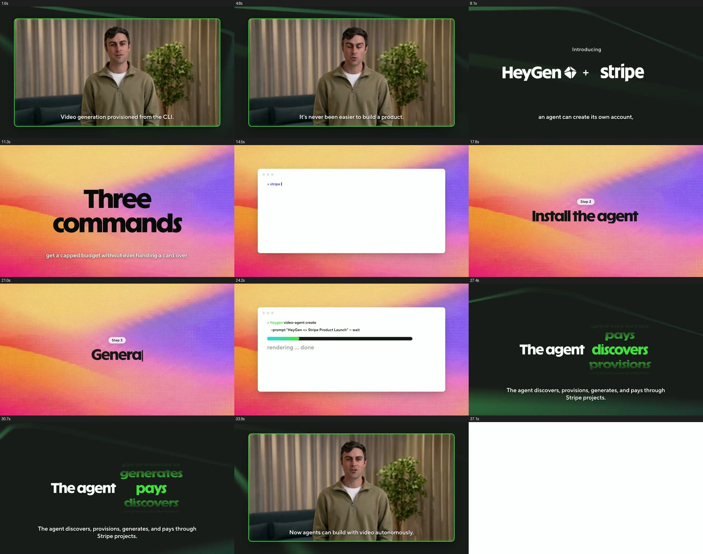
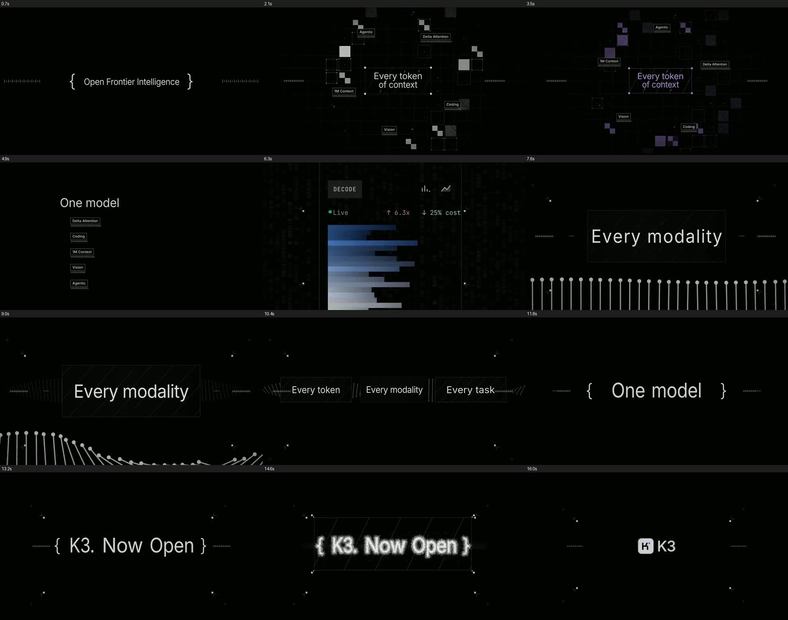
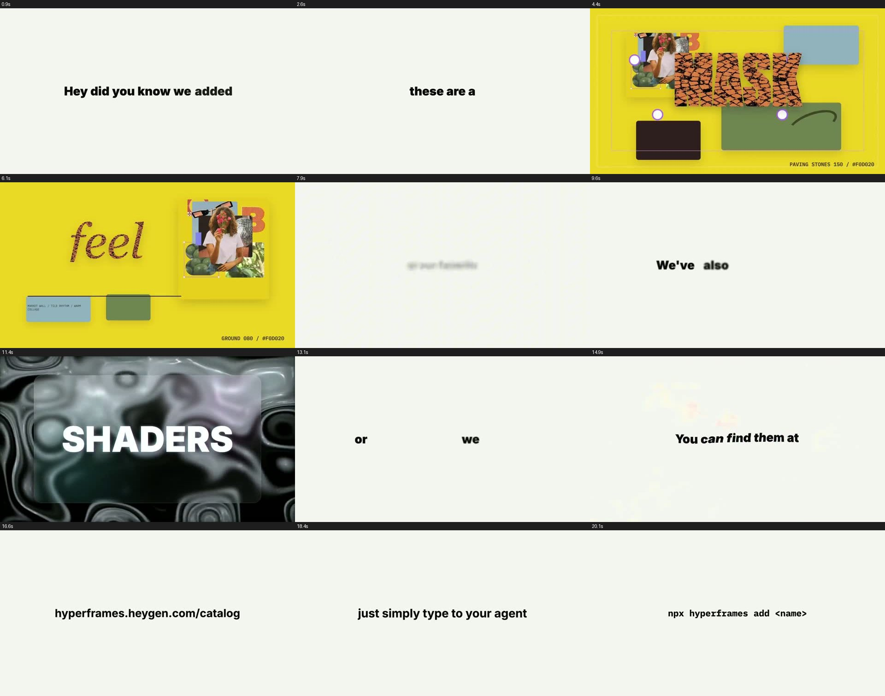
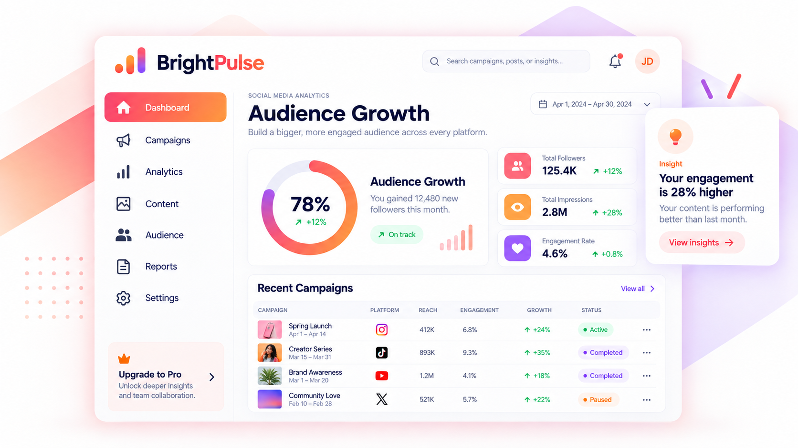
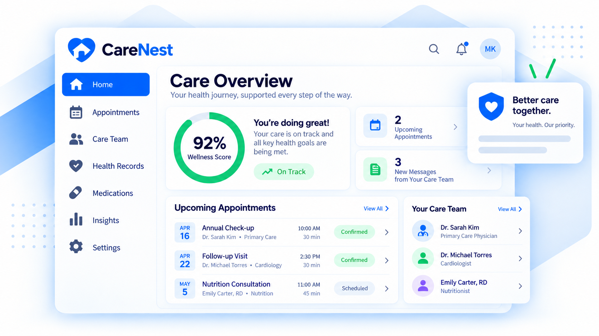
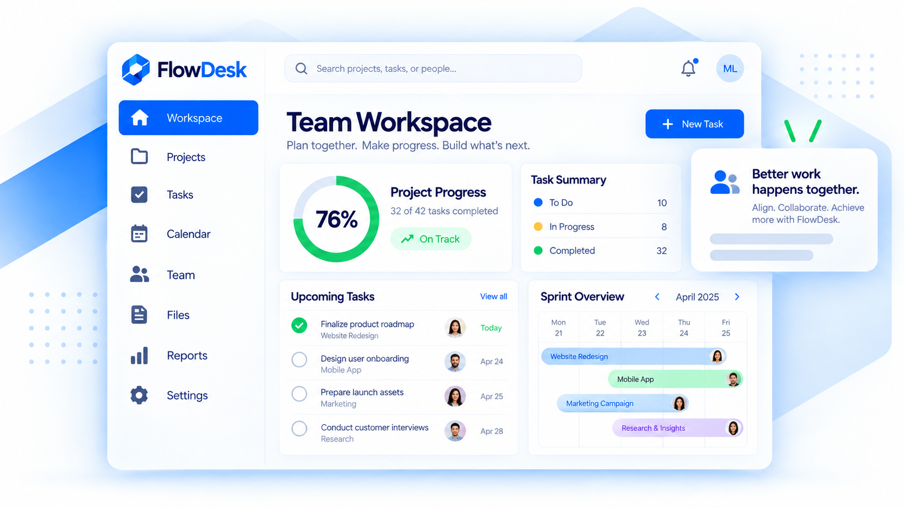
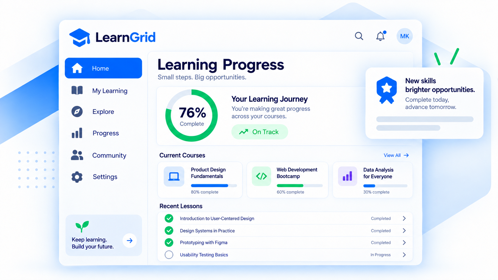
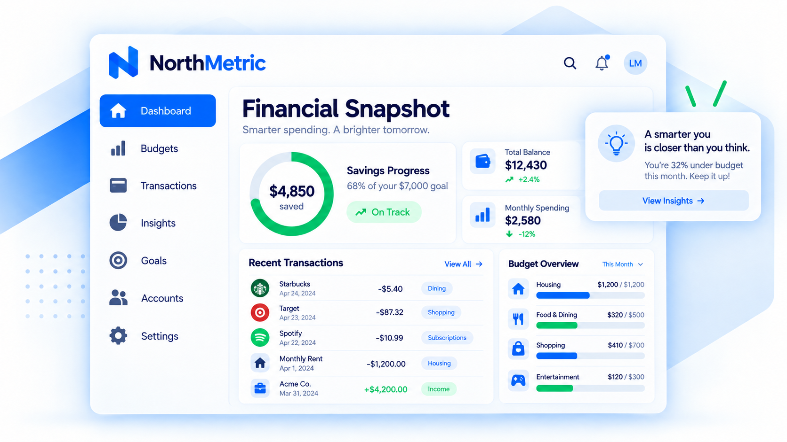
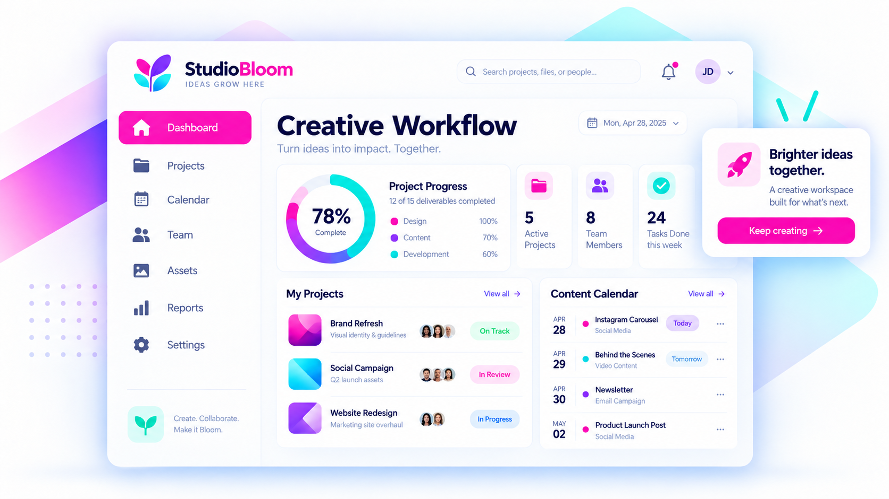

# DESIGN BRAIN

**A reference library for AI to pull inspiration from, so what it builds looks modern and feels good to use.**

---

## How to use it

Point your AI at a folder and say what you're making. It reads the files, copies the look, builds the thing.

Every collection is plain files: markdown specs the AI can read, plus HTML previews you can open in a browser.

## Collections

| | Collection | What's inside | Status |
|---|---|---|---|
| 🎬 | [**Hyperframes Catalog**](hyperframes-catalog) | 25 video looks: colors, type, components, caption styles | Live |
| 📱 | [**App UI**](app-ui) | App screen designs to reference | Live |
| 🌐 | Websites, user journeys, customer experience and more | See the [roadmap](#roadmap) | Coming |

## Peek inside

**Hyperframes Catalog** · click through to see all 25 looks

<table>
<tr>
<td width="33%"></td>
<td width="33%"></td>
<td width="33%"></td>
</tr>
</table>

**App UI**

<table>
<tr><td width="33%"> BrightPulse</td><td width="33%"> CareNest</td><td width="33%"> FlowDesk</td></tr>
<tr><td width="33%"> LearnGrid</td><td width="33%"> NorthMetric</td><td width="33%"> StudioBLoom</td></tr>
</table>

---

## The golden rule: no AI slop

AI makes generic, same-looking designs when it works from nothing. **The key to avoiding AI slop is giving it inspiration or a good example.** Always point it at a real reference from this repo, then tell it what to build.

## Roadmap

**Collections coming**

- [ ] 🌐 **Websites**: landing page sections (hero, pricing, social proof, footer) with annotated screenshots
- [ ] 🧭 **User journeys**: onboarding, signup, checkout and cancellation flows
- [ ] ✨ **Customer experience**: features and touchpoints that make people stay
- [ ] 🧩 **Design systems**: written summaries of rules from top products (Stripe, Linear, Vercel, Apple HIG, Material, Radix, shadcn/ui)
- [ ] 🎞️ **Motion**: animation timing and easing recipes
- [ ] 🔤 **Typography**: tested font pairings and type scales
- [ ] 🧱 **Components**: copy-paste patterns (nav bars, pricing tables, empty states, forms)
- [ ] 🚫 **Anti-patterns**: a "don't do this" list of generic and bad design

**Make it better for AI**

- [ ] Root `CLAUDE.md` / `AGENTS.md` telling the AI how to use the repo
- [ ] A `DESIGN.md` in every collection, same format (colors, type, spacing, components, rules)
- [ ] Short written notes on each screenshot: why it works
- [ ] Tags and an index per collection so the AI can search ("fintech", "dark", "dashboard")

**Repo basics**

- [ ] License and a source note for every collection
- [ ] "Add a new look" template so every entry has the same shape
- [ ] GitHub Pages so the catalog is browsable as a site

**Where to find inspiration:** Awwwards, Godly, Land-book, Lapa Ninja, Httpster, Mobbin, Screenlane, Page Flows.

---

More collections get added here as they're built.
