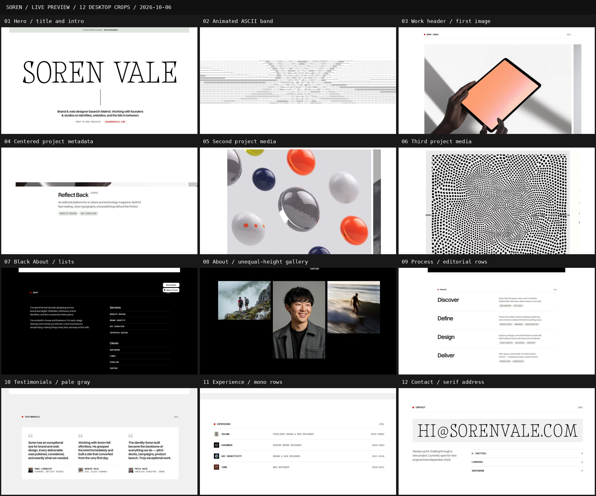

# WEBSITES

**Full website looks, specced so an AI can rebuild them. Pick one. Copy it. Done.**

---

## How to use it

1. **Browse** the sites below.
2. **Open** a folder and double-click `frame-showcase.html` to see the palette, fonts and components in your browser.
3. **Hand** the folder's `AI-HANDOFF.md` to your AI, along with `FRAME.md` and `reference-frames.jpg`.

## What's in each folder

| File | What it is |
|---|---|
| `FRAME.md` | The look: colors, fonts, layout, section anatomy, rules |
| `frame-showcase.html` | Visual preview. Open in a browser |
| `reference-frames.jpg` | 12 labeled crops from the live site |
| `screenshots/` | Full-page and per-section captures |
| `design-tokens.json` | Colors, type and layout as machine-readable values |
| `RESPONSIVE-AND-MOTION.md` | Breakpoints, interactions, recommended motion |
| `FIDELITY-CHECKLIST.md` | Acceptance checks for the rebuild |
| `AI-HANDOFF.md` | Paste-ready instruction for a coding AI |
| `evidence.json`, `assets-manifest.json` | Measurements and asset provenance |

## The sites

<table>
<tr>
<td width="33%" valign="top"> <b>soren</b> Editorial portfolio: huge ultra-light serif name, Switzer body, mono labels, square corners, red-orange accent, black bio section</td>
<td></td>
<td></td>
</tr>
</table>

---

[Back to Design Brain](../README.md)
